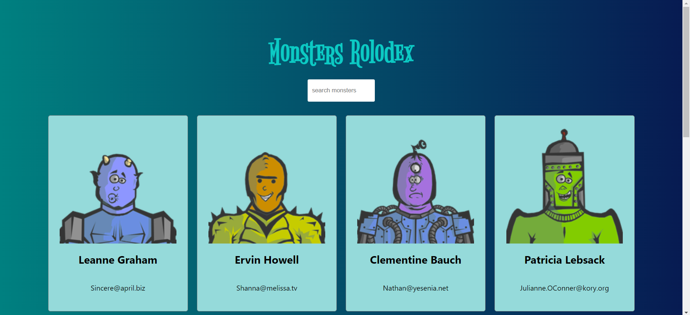

# Monsters Rolodex

### A small educational project: basics of React.

#### Learn:
1. Class Components vs Function Components
2. Hooks
3. setState
4. useState, useEffect
4. Working with JSON
5. Lifecycle Methods
6. Renders and Re-renders
7. Virtual DOM, ReactDOM
8. Paint Flashing from DevTool

### Preview

